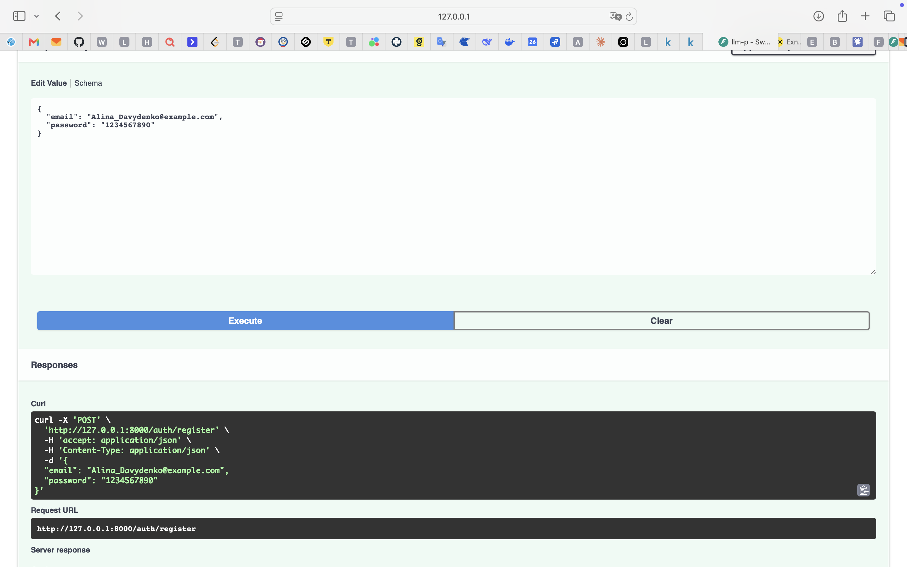
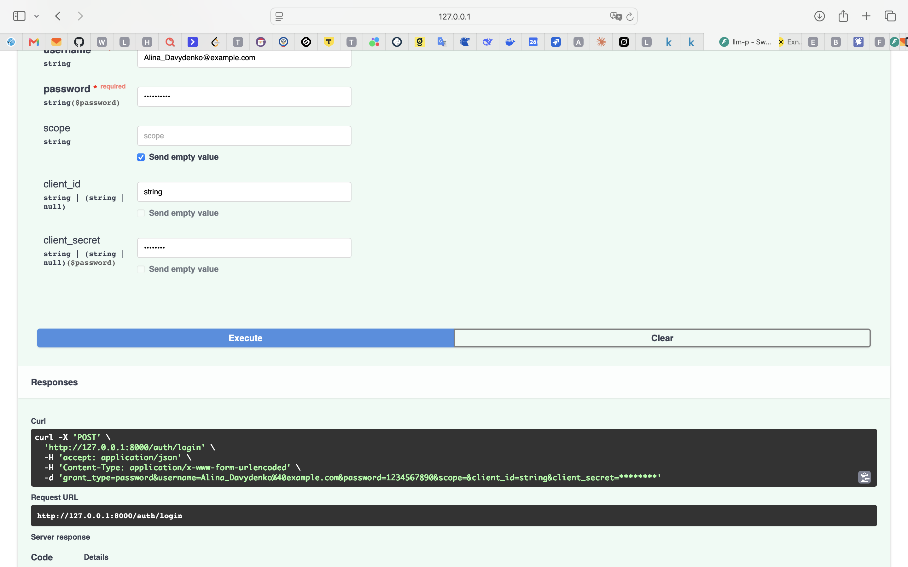
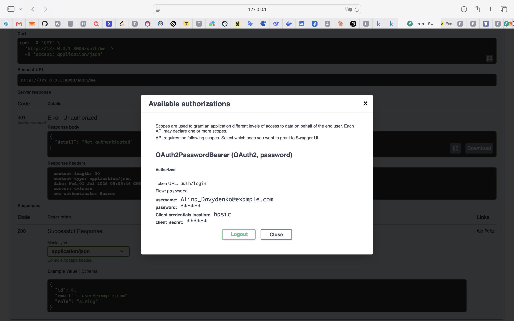
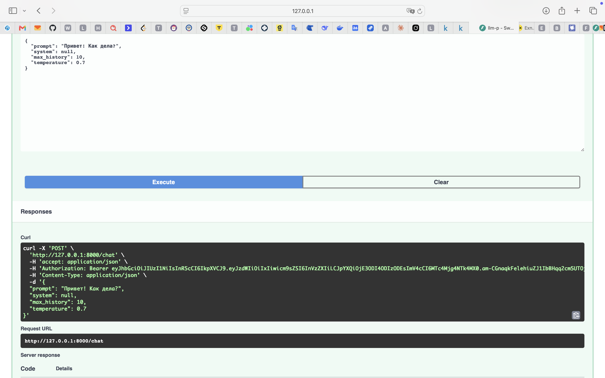
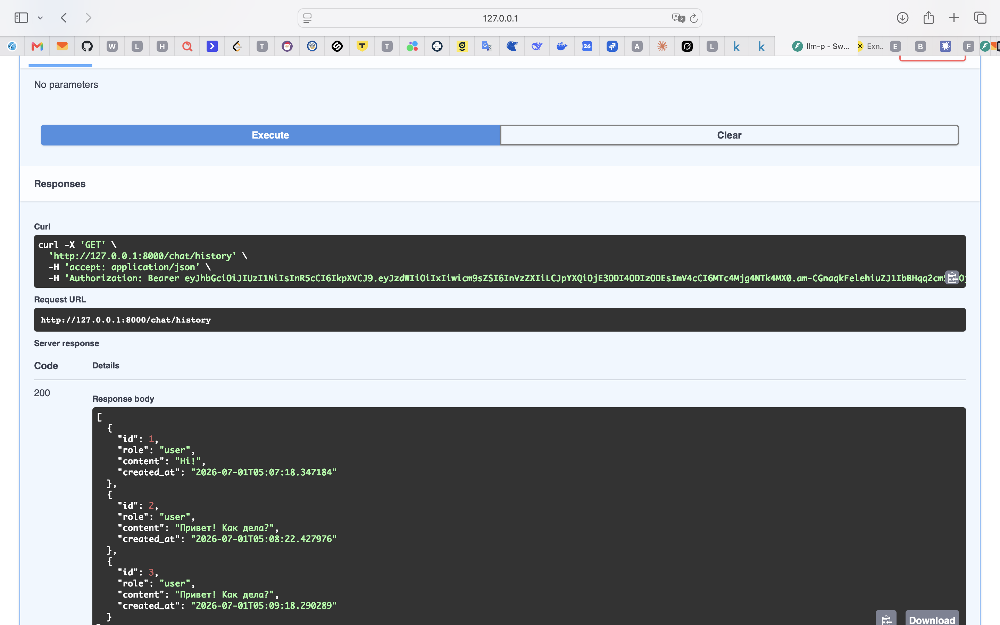
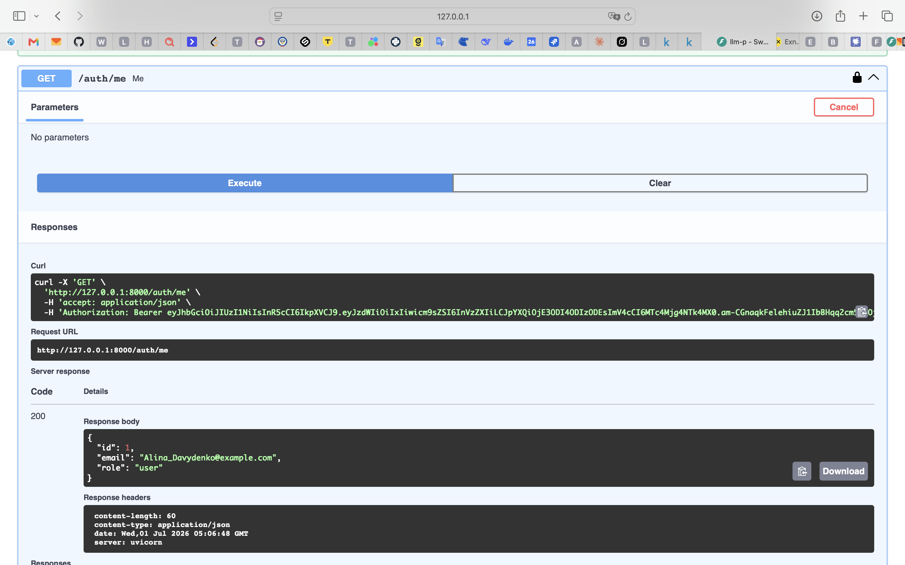
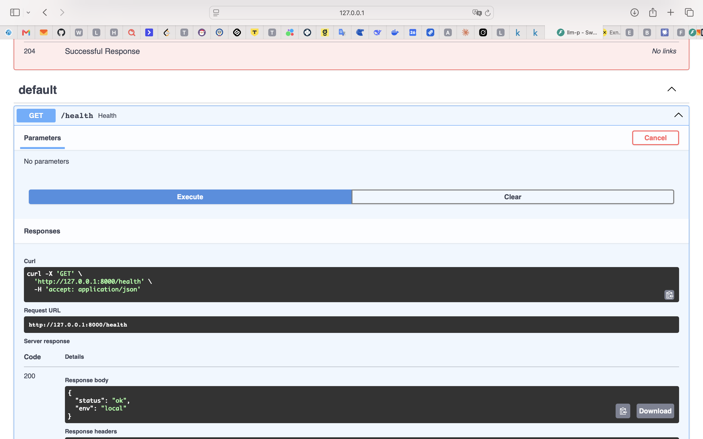
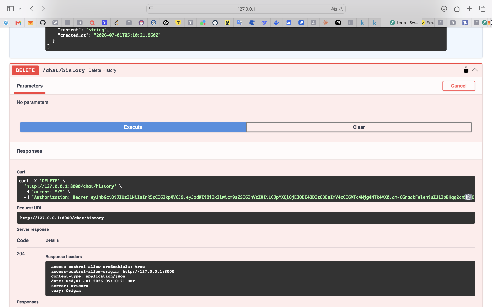

# llm-p

Серверное приложение на FastAPI, предоставляющее защищённый API для взаимодействия
с большой языковой моделью (LLM) через сервис OpenRouter. Реализована аутентификация
и авторизация пользователей по JWT, хранение данных в SQLite, а ответственность между
слоями приложения разделена по архитектуре API → UseCases → Repositories → DB / Services.

## Структура проекта

```
llm_p/
├── pyproject.toml
├── README.md
├── .env.example
└── app/
    ├── main.py                    # Точка входа FastAPI
    ├── core/                      # config, security (JWT/хеширование), errors
    ├── db/                        # base, session, models (User, ChatMessage)
    ├── schemas/                   # Pydantic-схемы auth/user/chat
    ├── repositories/              # users, chat_messages — только доступ к данным
    ├── services/                  # openrouter_client — клиент внешнего LLM API
    ├── usecases/                  # auth, chat — бизнес-логика
    └── api/                       # deps (DI), routes_auth, routes_chat
```

## Установка и запуск через uv

1. Установить `uv`:

   ```bash
   pip install uv
   ```

2. Инициализировать и настроить окружение:

   ```bash
   uv init
   uv venv
   source .venv/bin/activate    # MacOS/Linux
   .venv\Scripts\activate.bat   # Windows
   ```

3. Установить зависимости проекта (зависимости уже описаны в `pyproject.toml`):

   ```bash
   uv pip install -r <(uv pip compile pyproject.toml)
   ```

4. Скопировать `.env.example` в `.env` и вставить ваш `OPENROUTER_API_KEY`,
   полученный после регистрации на [OpenRouter](https://openrouter.ai/):

   ```bash
   cp .env.example .env
   ```

   ```
   OPENROUTER_API_KEY=ваш_ключ_без_кавычек
   ```

5. Проверить качество кода линтером:

   ```bash
   ruff check
   ```

   Ожидаемый результат: `All checks passed!`

6. Запустить приложение:

   ```bash
   uv run uvicorn app.main:app --reload --host 0.0.0.0 --port 8000
   ```

7. Открыть Swagger UI: <http://127.0.0.1:8000/docs>

## Проверка работы API

1. **Регистрация** — `POST /auth/register`. Использовался email формата
   `student_surname@email.com`.

   *(скриншот регистрации)*

2. **Логин и получение JWT** — `POST /auth/login` (OAuth2PasswordRequestForm,
   `username` = email).

   *(скриншот логина с JWT-токеном)*

3. **Авторизация в Swagger** — кнопка **Authorize**, вставить
   `access_token`, полученный на шаге 2.

   *(скриншот окна Authorize)*

4. **Запрос к LLM** — `POST /chat` с телом вида:

   ```json
   {
     "prompt": "Привет! Расскажи коротко, что такое FastAPI.",
     "system": null,
     "max_history": 10,
     "temperature": 0.7
   }
   ```

   *(скриншот ответа от LLM)*

5. **История диалога** — `GET /chat/history` возвращает список сообщений
   текущего пользователя (роль user/assistant, текст, дата).

   *(скриншот истории)*

6. **Удаление истории** — `DELETE /chat/history` очищает историю текущего
   пользователя (ответ `204 No Content`).

   *(скриншот удаления истории)*

## Эндпоинты

| Метод  | Путь             | Описание                                  | Авторизация |
|--------|------------------|--------------------------------------------|-------------|
| GET    | `/health`        | Проверка статуса сервера                   | нет         |
| POST   | `/auth/register` | Регистрация пользователя                   | нет         |
| POST   | `/auth/login`    | Логин, выдача JWT access token             | нет         |
| GET    | `/auth/me`       | Профиль текущего пользователя              | JWT         |
| POST   | `/chat`          | Запрос к LLM с сохранением истории         | JWT         |
| GET    | `/chat/history`  | Получение истории диалога                  | JWT         |
| DELETE | `/chat/history`  | Очистка истории диалога                    | JWT         |

## Архитектурные принципы

- **api/** — только HTTP-эндпоинты: парсинг запроса, вызов usecase,
  преобразование доменных ошибок в HTTP-ответы. Никакого SQL и прямых
  вызовов внешних сервисов.
- **usecases/** — бизнес-логика, не зависящая от FastAPI; работает только
  через репозитории и сервисы, выбрасывает доменные исключения из `core/errors.py`.
- **repositories/** — единственное место, где выполняются SQL/ORM-запросы.
- **services/** — интеграция с внешним OpenRouter API, не знает про БД и пользователей.
- **core/** — конфигурация, JWT/хеширование паролей, доменные исключения.
- **db/** — декларативная база, engine/sessionmaker, ORM-модели.

## Работа эндпоинтов 









